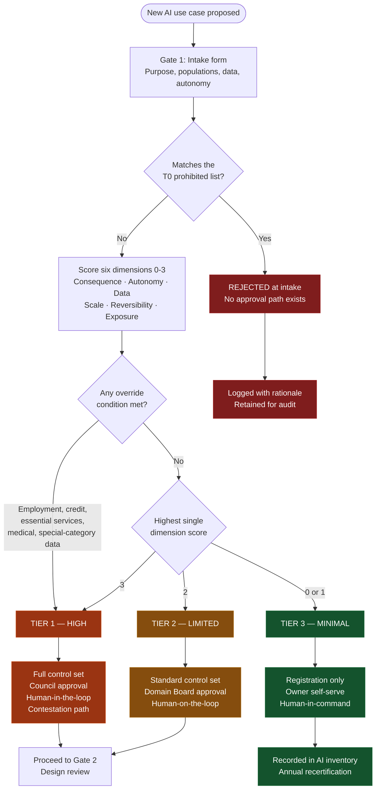

# Diagram 1 — Intake and Classification

How a proposed AI use case gets a tier. This is the entry point to every other process in the framework.

**Note the asymmetry between the two paths into T1.** The dimensional score can promote a case to T1, but the override conditions can *only* promote — never demote. A résumé screener with low autonomy still lands in T1 because it influences employment. Scoring is judgment, and judgment drifts optimistic under delivery pressure; the overrides are the backstop.

See [Classification Framework](../../docs/classification-framework.md).
