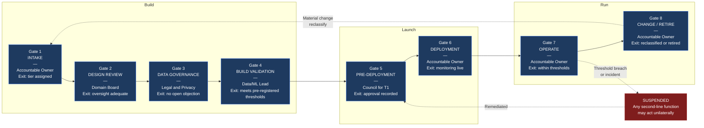

# Diagram 2 — Lifecycle Control Gates

The eight checkpoints every AI system passes through, with the owner and exit criterion at each. A gate that cannot be failed is not a gate.

**Two feedback loops carry most of the operational value.** The dotted line from Gate 8 back to Gate 1 is what prevents scope creep from silently escaping governance — a system that gains autonomy or a new data category re-enters classification rather than continuing under its original approval. The line from Gate 7 to SUSPEND is deliberately short: approval is slow and consensus-based, stopping is fast and unilateral.

**Pre-registration at Gate 4.** Evaluation metrics and passing thresholds are fixed at Gate 2, before any results exist. Choosing the metric after seeing results is how a failure gets laundered into a pass.

See [Governance Model §4](../../docs/governance-model.md).
