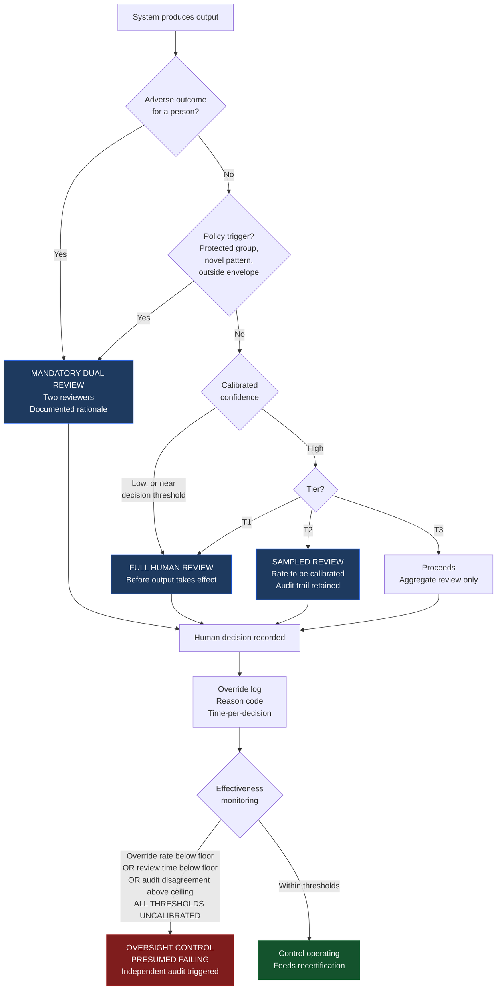

# Diagram 3 — Human Oversight Routing

How individual decisions are routed to human attention, and how the framework detects oversight that has degraded into a rubber stamp.

**The bottom loop is the part most frameworks omit.** Requiring human review is easy; detecting that the required review has become meaningless is the actual control. A sustained override rate below the calibrated floor is treated as evidence of *absent oversight* until an independent audit proves otherwise — because a very low override rate is ambiguous between an excellent system and a rubber stamp, and only post-hoc audit distinguishes them.

Override rate is never used as an individual reviewer performance metric. Doing so manufactures precisely the failure mode being measured.

See [Human-in-the-Loop §4–5](../../docs/human-in-the-loop.md).
