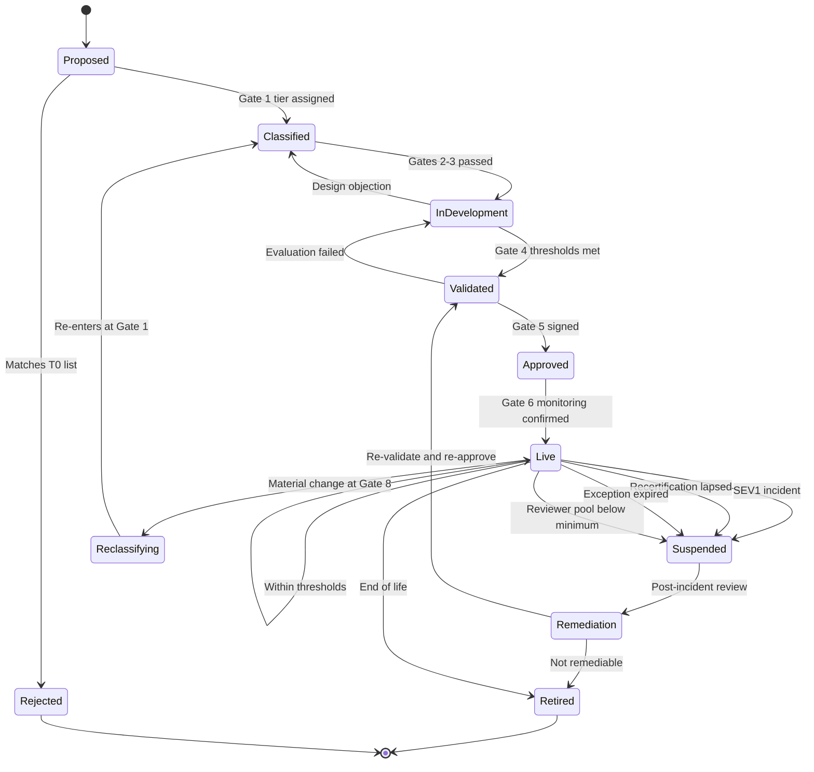

# Diagram 4 — Incident Response and System States

The states an AI system can occupy in production, and what moves it between them.

**Four of the five paths into Suspended are administrative, not technical.** A lapsed recertification, an expired exception, or a reviewer pool that fell below minimum size all suspend the system automatically — the same as a SEV1 incident. This is deliberate: governance decays through expiry and attrition far more often than through dramatic failure, and a framework that only responds to incidents will quietly accumulate unmonitored systems.

**Suspension is not a soft state.** Returning to Live requires re-validation at Gate 4 and fresh approval at Gate 5, not merely a fix and a restart.

## Incident severity

| Severity | Definition | Response | Council |
|---|---|---|---|
| **SEV1** | Harm to rights, safety, or livelihood; regulated data exposure | Immediate suspension | Convene within 48h |
| **SEV2** | Customer-facing error at scale; material financial impact | Contain within 24h | Next scheduled meeting |
| **SEV3** | Contained error, no external effect | Log and remediate | Reported in aggregate |

Every SEV1 and SEV2 post-incident review asks two questions: *which control should have caught this*, and *did that control exist but not operate — or not exist at all*. The second answer amends the framework itself.

See [Governance Model §7](../../docs/governance-model.md).
