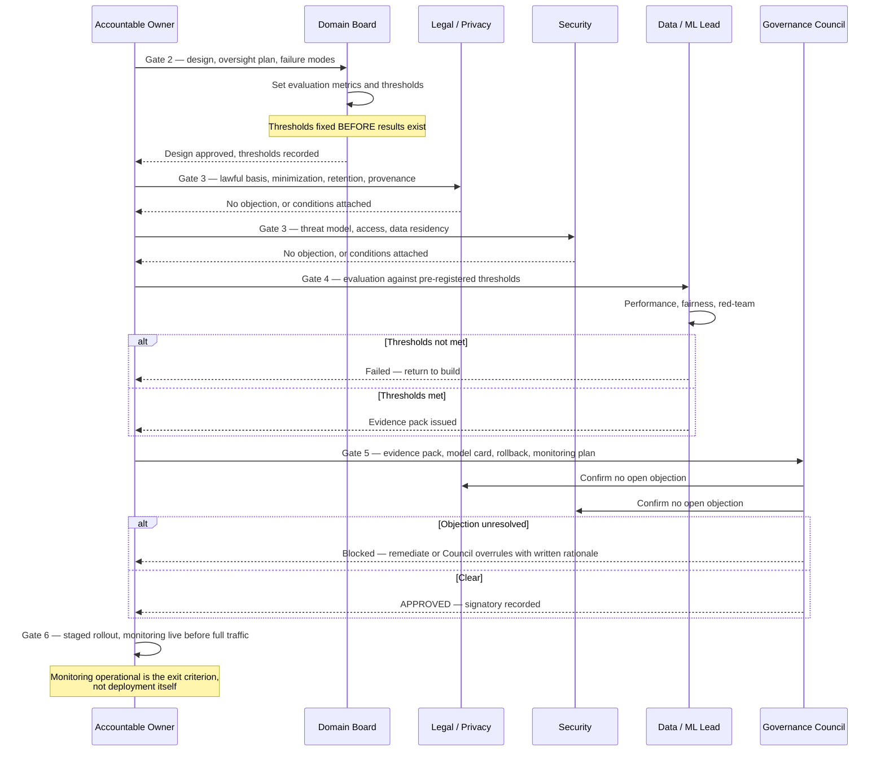

# Workflow — Approval and Launch

**Trigger:** A classified use case enters Gate 2.
**Owner:** Accountable Owner; approval authority varies by tier.
**Output:** A recorded approval decision with a named signatory, or a documented rejection.

Companion diagram: [Lifecycle Gates](../diagrams/02-lifecycle-gates.md)

---

## Approval authority

| Tier | Approver | Second-line role | Quorum |
|---|---|---|---|
| T3 | Accountable Owner | None | n/a |
| T2 | Domain Approval Board | Legal and Security consulted | Majority, with the domain lead present |
| T1 | AI Governance Council | Legal, Security, Risk each hold veto-to-escalate | Chair plus all second-line functions represented |

**Veto-to-escalate** means a T1 case cannot proceed over an unresolved second-line objection. The objection escalates to the full Council, which may overrule it only with a recorded written rationale naming the accepting executive. The objection and the overrule both persist in the audit record.

---

## Sequence

---

## The evidence pack

A T1 case arrives at Gate 5 with a single assembled pack. Approval is refused if any element is missing — not deferred pending it.

1. Intake form, tier assignment, and scoring justifications
2. Design document: architecture, data flow, failure modes
3. Human oversight design, including routing thresholds and reviewer pool plan
4. Data governance sign-off: lawful basis, minimization, retention, provenance
5. Security review and threat model
6. Evaluation results against **pre-registered** metrics and thresholds
7. Fairness and disparate impact testing across relevant populations
8. Red-team and adversarial testing findings, with dispositions
9. Model / system card
10. Monitoring plan: metrics, thresholds, alert routing, owner
11. Rollback plan, with evidence it has been tested
12. Contestation and appeal path design
13. Residual risk statement with named accepting executive

## Rules that make the gates real

**Pre-registration.** Metrics and passing thresholds are set at Gate 2 and are immutable through Gate 4 without Board re-approval. Choosing the metric after seeing results is how a failure is laundered into a pass.

**No conditional approvals into production.** An approval "subject to" outstanding work is a rejection with optimistic phrasing. Either the condition is met before launch, or it is a documented, time-bound exception with a compensating control.

**Monitoring precedes traffic.** Gate 6's exit criterion is confirmed operational monitoring, not deployment. A system live without monitoring is unobservable, and an unobservable system cannot be governed.

**Approval is personal.** Every approval names an individual signatory. Committees do not sign; people do.

**Stopping outranks starting.** Any second-line function may suspend a live system unilaterally on safety or legal grounds, without Council quorum. Approval requires consensus; suspension does not.
